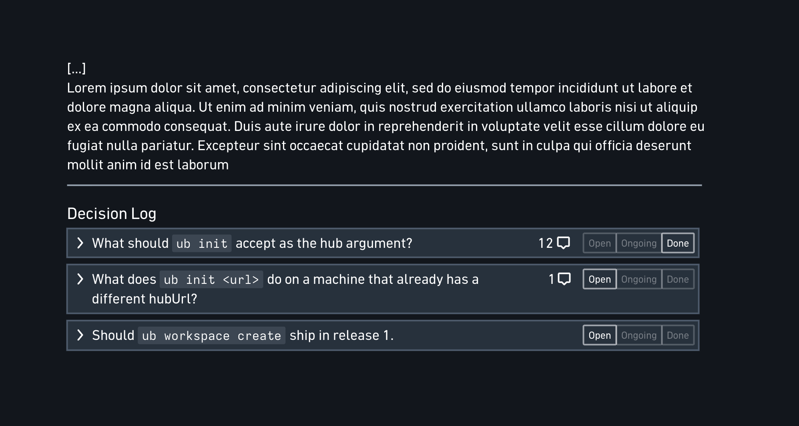

# Brief: the Decision Log on requirement documents

Status: **draft for adversarial review.** Not an issue, not a decision — the
input to one. Written 2026-08-28.

Parent feature: #438 (requirement documents: a first-class kind with a
lifecycle). This brief covers a structure that feature does not yet have.



## The problem

Decisions taken while building are currently unfindable. This week's isolation
work produced roughly twenty owner-level decisions — "slug is display, uuid is
identity", "no room-token audience, because every offline minter would have to
guess the spelling", "the rejection path fails closed, not open" — and every one
of them lives in a GitHub issue comment. Nothing indexes them, nothing lists
them, and an implementation agent starting cold cannot find the reasoning that
constrains the code it is about to write. The backlog reached ~432 KB of issue
bodies partly for this reason: with nowhere else to put reasoning, it went into
issue text.

**The boundary, settled 2026-08-29 and written into the Editorial contract:**
GitHub holds the implementation decisions belonging to one task — the choices
that die with the issue that made them. A decision that outlives its task
belongs in a document, **from the moment the question is raised rather than once
it is answered**. The test is whether the choice still binds anything once the
issue closes.

That amendment removed "open questions" from GitHub's column, where the contract
had previously placed them, and admitted `open` as a first-class state of a
decision record: an unanswered product question is durable context, not a task.
The decision log is where those records attach to the requirement they govern.

There is also a live workflow need. Under the one-shot agent architecture being
designed in parallel, an implementation agent that hits a micro-decision should
be able to **raise** it — question plus options — park that branch, and continue
on something else. The owner answers in the web. The next agent reads the answer
as context. Today that path is a `needs-decision` label plus a comment thread,
which is exactly what nobody can find later.

## What the mockup specifies

From the owner's screenshot, read literally:

- The Decision Log is a **section at the end of a document**, below the prose
  body, under a rule and an `## Decision Log` heading.
- Each decision is a **collapsible row**: the question as the title, a **comment
  count** (`12`, `1`), and a **three-state segmented control** — `Open` /
  `Ongoing` / `Done` — with exactly one active.
- Questions are written as questions: *"What should `ub init` accept as the hub
  argument?"*, *"What does `ub init <url>` do on a machine that already has a
  different hubUrl?"*, *"Should `ub workspace create` ship in release 1."*
- Expanded, a decision shows **prose context and options as a bulleted list**
  ("We ship it in release 1" / "We skip it and defer it for a later release"),
  then a **comment composer** with an avatar and a `Post` button.
- Inline code renders inside question titles (`ub init`, `ub workspace create`),
  so titles carry marks, not plain text.

## The owner's structural decision (settled)

Stated 2026-08-28, and **not up for review**:

> "It can be a structural thing that lives at the end of a product requirement
> doc. They can be related pages or any other array that defines them, but I
> would put them at a pre-defined slot towards the end of the doc — not a block
> that can be positioned anywhere. The goal for uberblick is also to be able to
> scan things quickly and predictably. So opinionated structure beats
> flexibility."

Consequences taken as given:

1. The decision log occupies a **fixed slot**, not free-floating blocks.
2. Its order is **stored**, not derived. An earlier proposal to render the log
   as *backlinks filtered to `kind = decision`* was withdrawn: backlinks are
   unordered and their membership shifts as links change, which is the
   unpredictability the owner is ruling out.
3. Opinionated structure wins over flexibility where they conflict.

## Proposed shape

**A fourth top-level structure on the document**, beside the three that exist:

```
meta          Y.Map          uuid, title, tags, description, kind, status
blocks        Y.XmlFragment  the flat block list
annotations   Y.Map          comment threads, keyed by thread id
decisions     Y.Array        NEW — ordered decision entries
```

This follows an existing precedent rather than inventing one: `annotations`
already lives outside `blocks` and is rendered in its own surface (the thread
rail). A fixed slot rendered after the body needs no "pinned block" enforcement
and does not fight the flat block list.

Each entry carries: the question (rich text — the mockup shows inline code), the
body/options, a status in `open | ongoing | done`, and its discussion.

## The open question this brief exists to settle

**What does the slot hold: inline entries, or an ordered array of references to
separate decision documents?**

The two people who have looked at this disagree, and neither is confident.

### Option A — inline entries

The `decisions` Y.Array holds the decision data directly.

- One room. No hydration cost. No directory stubs per decision.
- The decision versions atomically with the requirement it constrains.
- A decision that later proves cross-cutting can be *promoted* to its own
  document, with the slot holding a reference — so this does not foreclose B.
- Loses: full-text search over decisions as documents, backlinks, tags,
  `list_docs` filters, the editor, the tombstone — all of which the document
  machinery already provides for free.
- Needs new index code if "which decision covers workspace slugs?" is ever to
  be answerable.

### Option B — array of references (the owner's instinct)

The `decisions` Y.Array holds document uuids; each decision is its own document
with `meta.kind = decision`.

- Reuses everything: FTS, tags, backlinks, `list_docs`, export, editor,
  tombstone. Searching decisions is free.
- Decisions outlive the requirement that provoked them. "Slug is display, uuid
  is identity" governs a dozen requirements; as a document it is linkable from
  all of them, and the ordered slot still gives each requirement its own
  predictable list.
- ~~The collapsed list renders from **directory stubs alone**~~ — **FALSE, see
  Review round 1.** #439 is open; `kind`/`status` exist nowhere in the schema.
  The stub also carries no comment count, and its `title` is a plain string, so
  the mockup's `12 comments` and its inline code in the question title are both
  unreachable from a stub.
- Costs: a requirement with twelve decisions is thirteen rooms, thirteen
  directory stubs, thirteen SQLite rows. ~~which makes #83's eager-corpus bound
  concrete~~ — **wrong mechanism, see Review round 1.** #83 is closed and its
  decision was overturned by #379. The real pressure is unbounded `list_docs`
  (#320 closed) and the 32-per-wave attach queue.
- Forces `status` to become **kind-dependent**: #439 currently defines one
  closed set (`draft | planned | implementing | done`) legal only with `kind`.
  Decisions need `open | ongoing | done`. Each kind must declare its own status
  set — a small change, but cheaper to make in #439 before it ships than after.

## Secondary questions, genuinely open

1. **Where does the discussion live?** A doc-level annotation thread per
   decision (gives the mockup's comment count and composer semantics), or
   comments as ordinary blocks appended by whoever speaks (more uberblick-native,
   needs nothing new, loses the count). Under option B the decision document's
   own body could simply be the discussion.

2. **Markdown round-trip.** Export must emit the slot deterministically — a
   `## Decisions` section, same order, status included — or markdown stops being
   a faithful export the moment a requirement has decisions. Import must
   reconstruct it. Under option B, export of a requirement must decide whether
   to inline the referenced decisions' content or emit links.

3. **Unknown-structure degradation.** Unknown *blocks* currently degrade loudly
   (visible placeholder, explicit export marker). A new top-level structure has
   no such rule: an older client would silently not render it. What is the rule?

4. **Attribution.** #438 states that "the owner's quoted, dated decision in the
   implementing issue is the authority". A decision log intended to carry that
   authority needs trustworthy authorship, and awareness identity is
   self-asserted today (#84 is **closed NOT_PLANNED**, not parked — deliberately
   deferred behind a stated revival trigger: the first non-owner person or
   untrusted device on the tailnet). Acceptable for a single user; it is what makes decisions
   citable when there is more than one.

5. **Two lifecycles.** `meta.status` on a requirement is GitHub-driven (#442
   moves it from GitHub state). Decision status is uberblick-driven, set by a
   human in the web. These are independent — but should a requirement be able to
   reach `done` with `open` decisions? Surfacing the count is the minimum;
   whether to block is a product call.

6. **Does this generalize?** The proposal is really *documents may have
   kind-specific structured sections in fixed positions*. If so, that is an
   amendment to the decided doc layout in CLAUDE.md and should be stated once,
   deliberately, rather than grown one slot at a time.

## What the reviewer is asked to do

Rule on the **A/B question** with reasoning grounded in this repository's code
(`packages/schema/src/{doc,annotations,rooms,directory}.ts`, the MCP server's
replica and index, the web's rendering path), not in general principle. Then
take positions on the six secondary questions, and name anything this brief has
missed — particularly any way option B's room count breaks an existing bound, or
any way option A's lack of search makes the feature useless for its stated
purpose.

Constraints that are fixed: the fixed-slot decision above; one Y.Doc per
document; document state in Y.Docs, auth state hub-side; offline-first; no new
runtime dependencies; every step independently mergeable and reviewable in one
sitting.


---

# Review round 1 — adversarial, 2026-08-29

Full report in the coordination session. **Verdict: option B, ~65% confidence** —
but on none of the reasons this brief gave for it.

## The ruling's actual grounds

1. **`sidebar.ts:50-56` already decided this exact question.** "The order is an
   array of *ids*, not of the groups themselves, because Yjs has no move:
   reordering is delete-then-insert." Option A puts mutable, concurrently-edited
   entries directly in an ordered `Y.Array` — the shape that file rejected in
   writing. Reorder a decision under A and you clone-and-destroy it, dropping a
   comment or status change another replica made concurrently.
2. **A decision body is document-shaped, and this repo has one contract for
   editing that: block-scoped `edit_block` with per-block `rev`.** Under A the
   body is either wholesale-replaced JSON or nested Y types no reader here
   traverses.
3. **Under A a decision is unaddressable.** No uuid, so no `docLink` target
   (#450), no `backlinks`, no issue can cite it. The brief filed this under
   "loses search"; the addressability loss is larger and less patchable.

## Conditions of the ruling

- **The slot holds uuid strings only** — same shape as `SIDEBAR_ORDER_KEY`.
- **Do not ship onto today's discovery surface** (KILL-1 below).
- **`archive_doc` on a requirement must cascade to its decision refs**
  (MAJOR-4 below).

## Corrections to this brief's factual claims

| Claim | Reality |
|---|---|
| `kind`/`status` already mirrored in stubs | #439 is **open**; neither exists in `types.ts`, `directory.ts` or `doc.ts` |
| Collapsed row renders from stubs alone | No comment count in the stub; `title` is plain text, so the mockup's inline code is unreachable |
| #83's eager-corpus bound is threatened | #83 is **closed**, overturned by #379's B4 gate |
| #84 is parked | **Closed NOT_PLANNED**, with a recorded revival trigger |
| B "reuses everything"; only A needs the new root type | **Both** need it; B's array holds strings instead of entries |
| — | **#438 explicitly scopes out a `decision` kind**: "where decision records live is undecided… `kind` is closed to `requirement` until something queries another value." B reopens a deliberately deferred item, which is legitimate but must be stated |

## Findings

**KILL-1 — B on today's discovery surface makes the agent experience worse, and
the feature's own purpose is the casualty.** `list_docs` is unbounded
(`tools.ts:839-856`) and pagination is closed (#320). Forty requirements × twelve
decisions ⇒ ~450 stub rows, ~200 KB of JSON, on the first call a cold agent
makes — the eleven documents it wanted buried among four hundred decision stubs.
Then it pays a settle on every later call while those rooms drain 32 per wave
(`sync.ts:134`, `hub/src/config.ts:60`). *Fix:* land `list_docs {kind}` **and**
a default that excludes `kind = decision` from an unfiltered listing, in the same
PR as the decision kind. Otherwise wait for #379's B4.

**MAJOR-1 — the three-state control contradicts #441's read-only boundary, and
naive implementation is a data-loss bug.** `meta` is authoritative, the stub is a
cache; a click that wrote only the stub is silently overwritten by the next
`repairStub` from any replica holding the document — and the MCP server holds all
of them. The control must acquire the decision's room and write `meta.status`.
*Fix:* acquire-on-expand, and amend #441's boundary explicitly.

**MAJOR-2 — time-sensitive, and cheap only today.** #439 is **open**, tier 3,
`Touches: schema`. Making `status` a closed map keyed by `kind` is a data-shape
change now and a live-stub migration plus test rewrite after it ships. *Fix:*
amend #439's body now, even if the decision log itself waits.

**MAJOR-3 — the collapsed row needs stub extension.** Add
`commentCount?: number` with the same cache-quality framing as `updatedAt`, and
accept plain-text titles collapsed (marks on expand). Note every stub writer
rebuilds the whole object, so each new optional field must be carried forward by
all of them or it is erased.

**MAJOR-4 — under B, archiving a requirement orphans its decisions permanently.**
`archive_doc` tombstones one stub; there is no cascade. Twelve decision documents
stay live in `list_docs`, in `search`, attached on every replica, pointing at a
requirement nobody can open. *Fix:* cascade archive and restore across the
`decisions` array, reported per room in the existing `{applied, synced, partial}`
shape. **Neither advocate noticed this; it exists only under B.**

**MAJOR-5 — under A, decisions are invisible to markdown export and to any
re-seed.** `exportMarkdown` walks `meta` + `blocks` + optionally `annotations`; a
`decisions` root is simply absent. #379 contemplates re-seeding the corpus from
markdown — under A every decision would vanish with no error.

**MAJOR-6 — under A the discussion has no home.** `createAnnotation` requires a
real `blockId`; there are no doc-level threads in this schema. A would need a
second comment system beside the one that exists. The brief called this an open
question; it is a blocker.

**MINOR:** `docLink` can only target B (`canonicalDocumentUuid` accepts document
uuids only); `backlinks` will not see inline `docLink` references until #445
lands; twelve expanded decisions is twelve IndexedDB databases and twelve
presence publications; `create_doc` requires a non-empty description, which is
largely redundant with a decision's question.

## Positions taken on the secondary questions

1. **Discussion** — an annotation thread on the decision document, anchored to
   its question block. Do not invent doc-level threads. Comments-as-blocks is
   worse: it loses the count and dilutes FTS against the reasoning being sought.
2. **Markdown** — export inlines referenced decisions (keeps the export
   self-contained); import does **not** reconstruct references, and the doc says
   so. Note `links` is already absent from exported frontmatter, so the round
   trip is already lossy and nobody has recorded it.
3. **Unknown structure** — the block rule does not transfer. Unknown blocks are
   destroyed because y-prosemirror's binding deletes undeclared elements; an
   unknown *root type* is inert and preserved. Rule: a new top-level structure
   degrades to invisible-but-intact, and its only loss path is markdown
   export/import. State it in CLAUDE.md beside the block rule.
4. **Attribution** — accept it; record the boundary in the doc and let #84's
   revival trigger carry it. Do not build a half-trust mechanism.
5. **Two lifecycles** — surface the open-decision count, never block. A gate
   would put a second lifecycle authority inside the document, which #441 already
   refuses on the same grounds.
6. **Generalization** — yes, and state it once: *a document's `kind` may add a
   fixed, ordered, structured slot beside `blocks` and `annotations`*, with the
   closed set of slots named in CLAUDE.md, in the same PR as the first one.

## The strongest argument against the ruling

The corpus multiplier arrives **before** the machinery that absorbs it. #379 is
unratified, B4 undesigned, `list_docs` unbounded. Meanwhile A's search gap is
~5 lines in `indexRows`, and this brief's own escape hatch — promote a
cross-cutting decision to its own document — buys addressability where it is
actually needed. If this should ship in weeks rather than after the refoundation,
A-with-promotion ships now and converges on B later, at the cost of two shapes in
one slot.

## The one number that would settle it

**How many live documents does the workspace hold today?** One `list_docs` call
answers it, and it decides whether KILL-1's condition means "add a filter" or
"wait for B4". Not answerable from this session — no MCP reachability.


---

# What the live corpus settled (2026-08-29)

Written after MCP access was restored. Both prior review rounds ran without it,
and three of this brief's claims were guesses that the corpus answers directly.

**Decision records already exist as a sanctioned shape.** The Editorial contract
(`5e0e25d8-c71f-44c3-9bf3-93662712c1fc`) lists six document shapes, one of which
is a decision record: *a question that binds the code, the options weighed, the
choice, the reasoning that produced it, and the trigger that would revive the
alternative.* This feature gives that shape structure; it does not invent it.
**The revival trigger is a required element and this brief omitted it** — added
to #462 and #463, where `set_status` now refuses `decided` without one.

**`decision` is already a tag** in the taxonomy, and the contract warns that a
new tag is a deliberate act. `kind = decision` is machine semantics selecting the
status set and driving filters; the tag stays navigational. Both, not either.

**Fifteen documents, not four hundred.** The adversarial review's KILL-1 — 450
stubs burying a cold agent's first `list_docs` — assumed forty requirements with
a dozen decisions each. The filter is still right; its urgency was overstated,
and #463 now says so.

**Approval was half-stated.** General Agent Workflow
(`c0bb016d-3d4c-4316-9b4e-da8a7b322e55`): *"Approval is never inferred from a
citation: an issue that implements a requirement **quotes** the owner's dated
decision in its body, **cites** the requirement by uuid."* The decision document
is the durable record; the quote in the issue is what makes work approved. The
owner's inversion moved the record, not the approval mechanism.

**Two principles already argue for this feature.** The draft *Product principles*
(`4d6e1193-423d-494e-b522-221202f228af`, pending approval on #460): principle 5,
"keep product context, decisions and their reasoning discoverable in durable
shared records… without relying on private conversation history"; principle 7,
"proactively surface decisions needing attention… without requiring the user to
know what to ask" — which is the attention management deferred out of this MVP.

**The lesson worth keeping.** Both review rounds and the first issue drafts were
produced without reading the corpus, and re-derived rules that were already
written down. That is precisely the failure this feature exists to prevent, and
it happened while designing it.
