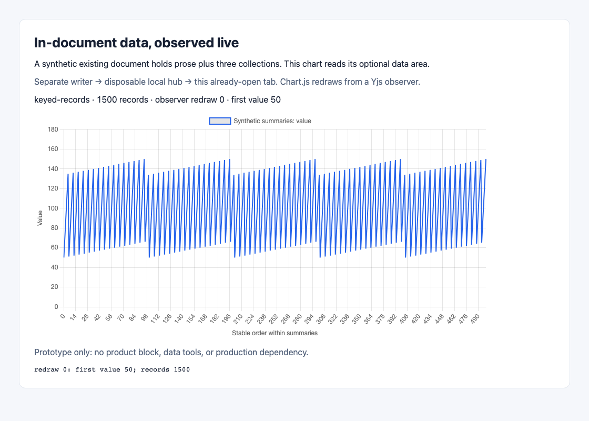
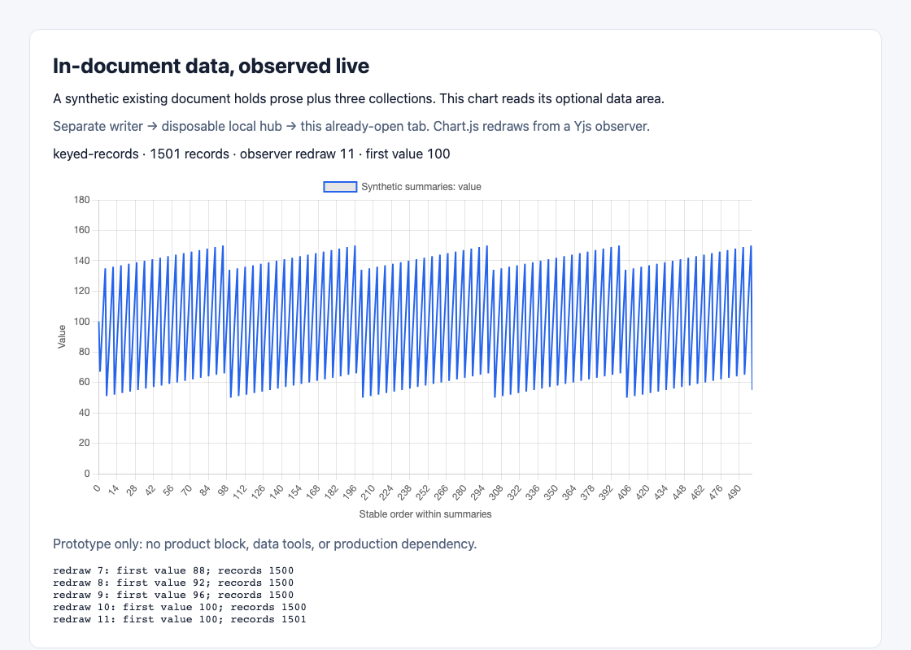

# In-document data and live charts

This is the review-only feasibility report for [#1398](https://github.com/uberblick-ai/uberblick-2/issues/1398), under its owner-approved route. It proposes no production change. [PR #1403](https://github.com/uberblick-ai/uberblick-2/pull/1403) must remain draft, retain `needs-review` and the owner's `needs-human` stop, and never enter integration or merge. The owner superseded the original ban on workflow labels. Independent Claude review at `6374e7f57d2da35f181469c69c6c32f5a87c8220` found [R1-F1](https://github.com/uberblick-ai/uberblick-2/pull/1403#pullrequestreview-5456867763); different-model corrections review at the revised head and the owner's verdict remain required. [#1397](https://github.com/uberblick-ai/uberblick-2/issues/1397) stays open. Final closure of this unmerged PR will require explicitly closing #1398 after the verdict; nothing closes now.

## Question and plain-language finding

Can several small structured collections live beside prose in one existing Yjs document and drive a chart which changes when another writer updates the data?

Yes, within the tested bounds. A separate writer updated an existing document over the real local hub protocol, and a chart in an already-open browser tab redrew from Yjs observers. It needed no reload, view polling or manual rerender. The browser wrote nothing back into the document. This was a prototype page connected directly to the hub, not the production editor or the normal `ub open` serving-replica path.

Recommend **keyed JSON records with versioned collection descriptors for append-dominated or change-aware producers**, with explicit identity/order and invalid-version handling. A small correction sends far less data, but corrections spread across many keys leave CRDT history which ordinary SQLite compaction cannot remove. Rewriting every record daily is a different workload: the fixed-record sensitivity grows keyed state from 0.81 MB to 4.63 MB in one year, while envelopes stay near 0.76 MB. The original same-record-only benchmark missed this cost. The one-year histories below separate new live records from historical overhead and make the recommendation conditional on producer behavior and resource budgets.

Envelope shapes remain useful for frequent broad refreshes, small infrequent datasets and simpler schema/data coherence. Their full-value writes can create much larger transfer and local-log costs even when the final snapshot stays small. The hub still encodes/stores the full state for every shape. This report recommends planning candidates, rather than selecting one unconditional representation for all uses.

The browser evidence also exposes unfinished work: the keyed prototype rebuilt/cloned all collections on every change, taking longer to project than the envelope even though transport/apply was much cheaper. Storage representation does not by itself make views incremental. No production representation, dependency, API, limits or migration policy is selected by this report.

## Alternatives

All candidates use one optional `spikeData` Y.Map root alongside the unchanged `meta`, `blocks` and `annotations` roots. This root name and format are throwaway. None stores the data in a separate workspace or relational data model. JSON values are replaced, never mutated in place behind Yjs's back.

| Candidate | Identity and order | Schema/data coherence | Cost of change |
| --- | --- | --- | --- |
| Whole-document envelope | One JSON value holds format version and all collections; rows carry stable ids; array order is explicit. | Schema and data in that one value share a conflict winner. Concurrent replacements can lose the other writer's entire data area. | Append or correction replaces every collection. |
| Collection envelopes | One JSON value per named collection holds schema version, schema and ordered records; stable ids live in rows. | Each collection remains internally coherent; concurrent changes can leave different collections at different revisions. No cross-collection invariant is implied. | Replaces the affected collection. |
| Keyed records | Collection descriptors and records occupy separate keys; ids are stable and globally namespaced; rows carry ordinal, with id as tie-breaker. | Schema and record keys have independent conflict winners. Versioning and validation must detect incompatible rows after a merge. | Replaces the affected JSON record; adding a collection/schema still requires a descriptor. |

The generator uses three collections, `summaries`, `issues` and `endpoints`, with nested JSON values. The keyed representation is an id-addressed ordered record collection, not a way to preserve every possible arbitrary JSON shape without an API contract. A future production schema must define whether collections are ordered records, objects or arrays and preserve that distinction. Production reordering, deletion, renamed collections, duplicate-id handling, field ownership guards and migration are not implemented here. The annual API fixture preserves human dispositions as separate records by excluding them from producer writes; this is a workload assumption, not a delivered ownership policy.

One local Yjs transaction batches observers and applies synchronously at that replica. It does **not** make distinct map keys one conflict unit between concurrent replicas. The retained convergence probe demonstrates schema v1 plus row-a versus schema v2 plus row-b: the replicas converge, but one winning schema coexists with both rows. Native conflict winners do not promise wall-clock last-write order. This is within the owner's accepted competing-write loss; it is still a schema-validity problem that readers must detect.

Schema evolution for the document envelope replaces schema and rows together. A collection envelope can migrate one collection the same way. Keyed records need a schema version on records or a collection generation scheme, rejection of unknown versions, and validation of the merged read projection; these are planning recommendations, not delivered migration machinery. A row-version mismatch must show unavailable/invalid data rather than a plausible chart from incompatible fields.

## Grounding and boundaries

Code and local instructions were read at base `dfc21fe4991967090e43e8473af3ae71d2c1a184`, fetched from `origin/main`. Measurements use that implementation, preserved as this report branch's parent. At publication, `origin/main` had advanced to `10a8f775dbd7e324a80ee4ffa0dc0ba909493ba8` with MCP tool extraction; results are not claimed against that later code. A merge-tree check was clean. The prepared contract is current. The [earlier spike](704-daemon-authority.md) informed the separation of verdict, method, evidence and limits; no archive tag is created.

The correction pass fetched `origin/main` at `72fe6f249ee2b47a8dc8e1abdd43b9800352c383` and continued the report/prototype at `6374e7f57d2da35f181469c69c6c32f5a87c8220`. The launcher's current control instructions and owner correction route govern this run; the retained prototype still measures its original code base. Inspection found storage/schema/hub/view code unchanged, with only a comment change in `replica.ts` and MCP registrations moved from `tools.ts` into `tools/` on main. Historical code links below remain pinned to the measured base. Live corpus catalog, decisions, searches and all seven pointed documents were read again for the correction; no dataset/chart/library-selection commitment was found.

Final validation refreshed main to `8e413177931d4937475978e092ed554c3947189f`; the intervening CLI onboarding/output changes do not alter the storage, schema or hub algorithms measured here. The correction's publication record names the exact evidence revision and check results. If that revision is on the assigned correction branch while PR #1403 still has its old head, it awaits restoration of the required PR stop before protected advancement; branch evidence alone is not the corrections-review verdict.

Live corpus discovery on 2026-10-08 used the registered `.mcp.json` stdio route (`mise exec -- ub mcp serve`), its discovered tool schemas, `get_sidebar`, `list_tags`, `list_docs`, `list_docs(kind: decision)` and purpose searches. Searches for `chart*`, `dataset*`, `librar*`, `Yjs` and `CRDT` found no governing dataset, chart or chart-library policy. Relevant documents were read live:

- Welcome to Überblick (`2d56b281-5614-43bd-b8d8-edd1c270a85a`): local-first, hub optional.
- How to Use It (`d7ddd0b1-fee9-4ef0-8f1e-42882f925c31`): archived documents fully read-only; decided title/decision line/blocks read-only; unwritable rooms cannot edit content.
- Web UI system (`622ca00f-3dbd-4f65-b749-e46a81e704c4`): framework primitives and shadcn defaults; no chart-library selection policy.
- Permissions (`eb9a7801-05f3-417a-81d5-07c18795ac81`): workspace access is separate from presentation; hiding raw data is no access boundary.
- CLI: ub status (`fc7e5f5f-0d2a-45b0-ac62-b8b9b7edf0d5`): sync acknowledgement is not durable hub storage.
- CLI: ub open (`7bf6708f-4507-41ed-9efc-1b569490830f`): the normal browser reads the serving computer's replica.
- CLI: project binding (`8b77fe68-4ca4-4335-8631-5a3db2b99135`) and Command Line Interface (`c24f998c-91ce-45ef-aba9-e02b0e6ca47b`): explicit project binding and overrides.

The shared corpus was read only. Prototype writes use fresh synthetic UUIDs, a private local SQLite store and a loopback hub, never the checkout's committed shared workspace binding. No production source, production package manifest, lockfile, corpus or workflow configuration is changed. The prototype directory has only a private ES-module package marker. Chart.js is installed only in disposable scratch; a production chart/validator dependency still needs the owner's choice. The chart library was used to avoid replacing normal chart rendering with bespoke mechanics.

## Environment, generation and reproduction

The recorded run used macOS/Darwin 27.0.0 arm64, Apple M2 Ultra (24 logical CPUs), 64 GiB RAM, Node 26.7.0, V8 14.6.202.34-node.28, SQLite 3.53.4, pnpm 10.34.5, Yjs 13.6.32, Hocuspocus 4.6.0, tsx 4.23.12 and prototype-only Chart.js 4.5.1. Browser versions are recorded with the browser results. The host was not CPU-isolated; the different investigations could overlap. Treat small timing differences and tail values as directional.

The [generator and representations](1398/representations.mjs), [benchmark](1398/measure.ts), [raw results](1398/results.json) and [compatibility probe](1398/compatibility.ts) are retained in this unmerged PR. All fixtures are synthetic. The report below contains the method and measurements independently of disposable databases or a running prototype.

Generation uses total record counts 300, 1,500 and 3,000, divided equally across `summaries`, `issues`, `endpoints`; any remainder goes to summaries then issues. A fourth case uses 1,500 rows with a 4,096-character ASCII note in **every** row. Each collection has schema version 1 and the same closed object schema with all 25 fields required. JSON field order is the order below. For local row ordinal `i`, collection name `n` and collection index `c` (0, 1, 2), the exact values are:

| Fields | Generation rule |
| --- | --- |
| `id`, `ordinal`, `day`, `value`, `note` | `n + '-' + i` padded to six digits; `i`; `2026-01-DD` where DD is `i % 28 + 1`; `50 + (i * 17 + c * 11) % 101`; `Synthetic record i in n.` (literal substitutions), or `synthetic-long-value-` repeated 205 times and sliced to 4,096 characters. |
| `title`, `status`, `owner`, `category`, `source`, `region` | `n record i`; cycle `open`, `done`, `waiting`; `synthetic-person-` + `i % 7`; `category-` + `i % 5`; `synthetic-fixture`; cycle `region-a`, `region-b`. |
| `count`, `durationMs`, `score`, `active`, `labels`, `metrics` | `i % 31`; `10 + (i % 100) / 10`; `(i % 100) / 100`; `i % 2 == 0`; `['synthetic', 'group-' + i % 4]`; `{min: i % 10, max: 100 + i % 10}`. |
| `url`, `endpoint`, `severity`, `retries`, `currency`, `cost`, `parent`, `extra` | `https://example.invalid/record/n/i`; `/synthetic/` + `i % 8`; `i % 4`; `i % 3`; `EUR`; `(i % 1000) / 100`; null for i=0, otherwise `n-000000`; `{synthetic: true, group: i % 9}`. |

The schema declares the corresponding scalar types, homogeneous string `labels`, closed nested `metrics`/`extra` objects with required keys, and nullable-string `parent`. Logical data is `{formatVersion:1,collections:{name:{schemaVersion:1,schema,records}}}`. Keyed records have schema version only in the collection descriptor in this measurement, **not** a version on every row. Adding row version/generation metadata in production changes bytes and must be remeasured.

Yjs v1, default garbage collection and no compression are used throughout. Pure benchmark producer client id is fixed at 1398 for repeatable bytes; receiver fixtures use distinct ids. No live room reuses these fixtures. For each shape/case, capture the single `update` event from initial population, then one append to summaries (the next row generated with total count +3), then correction of `summaries-000000.value` to 9999. Record `byteLength` for these payloads and `Y.encodeStateAsUpdate` after each operation. There is no transport pacing in this benchmark.

Time only `Y.applyUpdate` with `performance.now`: initial to a fresh receiver; append to a fresh receiver preloaded with initial state; correction to one preloaded with post-append state. Setup/loading/destroying receivers is outside the timer. Run five warmups and 30 samples, report lower-middle median (15th sorted sample) and nearest-rank p95 (29th). These are local CRDT decode/apply microbenchmarks, without document indexes, SQLite, validation, observers, networking or chart work.

Storage uses actual `MirrorStore.appendUpdate`, `MirrorStore.compact`, `HubDatabase.onStoreDocument` and SQLite queries on fresh private files. It is a separate history: initial population followed by corrections of the same first summary row to `10000 + correctionNumber`, without an append. Run 501 corrections for each 1,500-row short-value candidate and 10 for every other case. Writes are unpaced/sequential, one transaction each; await a full hub snapshot store after each. Measure BLOB sums separately from database/WAL file allocation. At 500 log rows (initial +499 corrections), the driver invokes the existing store compaction synchronously at the replica's default threshold. This measures the storage operation, **not** when the production replica scheduler would run it. No vacuum is performed. Replay local snapshot plus remaining log and reload the hub snapshot; assert both equal the final logical projection. The production hub normally debounces stores; storing after every correction here deliberately measures full-state work, not its real frequency.

To reproduce from this PR's exact revision, install the repository's frozen dependencies (`mise trust`, `mise run install`). Choose an absolute private scratch directory outside shared storage; do not use the committed `.uberblick.json` for any prototype writes. From `packages/mcp-server`, run:

```sh
mise exec -- node --import tsx ../../docs/spikes/1398/measure.ts /ABSOLUTE/PRIVATE/SCRATCH
mise exec -- node --import tsx ../../docs/spikes/1398/compatibility.ts
```

The first command rewrites `results.json` with that run's timings and exact byte results; the second prints its assertions/results. `node --import tsx` avoids the tsx CLI's Unix socket path limit in a deeply nested scratch directory. The benchmark cleans up its own temporary databases. Browser reproduction is specified below. No tag or merge is needed.

## Measured results

Exact bytes, without compression, from the three-operation series. This microbenchmark document contains only the data area; ordinary prose/metadata overhead is added in the browser experiment. Initial full state equals initial-write payload. Full state after append/correction is also retained in the raw JSON; the final column shows post-correction state here.

| Rows / notes | Shape | Initial state/write B | Append update B | Correction update B | State after correction B |
| --- | --- | ---: | ---: | ---: | ---: |
| 300 / short | Document envelope | 152,794 | 153,269 | 153,271 | 153,293 |
| 300 / short | Collection envelopes | 152,841 | 51,904 | 51,906 | 153,347 |
| 300 / short | Keyed records | 163,612 | 531 | 481 | 164,148 |
| 1,500 / short | Document envelope | 755,650 | 756,128 | 756,130 | 756,152 |
| 1,500 / short | Collection envelopes | 755,697 | 254,859 | 254,861 | 756,206 |
| 1,500 / short | Keyed records | 809,665 | 534 | 481 | 810,204 |
| 3,000 / short | Document envelope | 1,509,225 | 1,509,703 | 1,509,705 | 1,509,727 |
| 3,000 / short | Collection envelopes | 1,509,272 | 508,550 | 508,552 | 1,509,781 |
| 3,000 / short | Keyed records | 1,617,240 | 534 | 481 | 1,617,779 |
| 1,500 / long | Document envelope | 6,851,980 | 6,856,521 | 6,856,523 | 6,856,545 |
| 1,500 / long | Collection envelopes | 6,852,027 | 2,290,532 | 2,290,534 | 6,856,599 |
| 1,500 / long | Keyed records | 6,905,995 | 4,597 | 4,546 | 6,910,597 |

Keyed records cost about 7.1% more initial state for short values, but turn a standard correction into 481 B independently of record count here. They replace a whole record, not a field: the long-value correction still sends its 4,096-character note. Long notes move 1,500 records from roughly 0.8 MB to roughly 6.9 MB. Row counts alone describe capacity poorly. No long-value hub/browser delivery was tested; those sizes are local encoding/apply/storage measurements.

Local `Y.applyUpdate` times in milliseconds (five warmups, 30 samples). Median, p95, minimum, maximum and sample counts, including initial/append p95 values, are retained in [results.json](1398/results.json); individual timing samples were not retained for this original run.

| Rows / notes | Shape | Initial median | Append median | Correction median / p95 |
| --- | --- | ---: | ---: | ---: |
| 300 / short | Document envelope | 1.830 | 1.820 | 1.803 / 3.180 |
| 300 / short | Collection envelopes | 1.818 | 0.608 | 0.603 / 0.642 |
| 300 / short | Keyed records | 1.896 | 0.0085 | 0.0092 / 0.0242 |
| 1,500 / short | Document envelope | 8.765 | 8.697 | 8.763 / 10.217 |
| 1,500 / short | Collection envelopes | 8.839 | 2.901 | 2.864 / 3.118 |
| 1,500 / short | Keyed records | 9.681 | 0.0088 | 0.0096 / 0.0157 |
| 3,000 / short | Document envelope | 18.388 | 18.419 | 18.253 / 23.190 |
| 3,000 / short | Collection envelopes | 18.364 | 5.785 | 6.868 / 7.319 |
| 3,000 / short | Keyed records | 19.212 | 0.0098 | 0.0120 / 0.0214 |
| 1,500 / long | Document envelope | 9.829 | 9.866 | 10.031 / 10.375 |
| 1,500 / long | Collection envelopes | 9.809 | 2.968 | 3.143 / 4.110 |
| 1,500 / long | Keyed records | 9.925 | 0.0091 | 0.0106 / 0.0278 |

The bigger note case is only slightly slower to apply locally than the short-note case. Fixed field/item counts and repeated simple strings may explain part of that result; no profiling established the cause. It is not a promise about distinct strings, memory, serialization, validation or transport.

Original same-record storage history for 1,500 short-note records. Every correction targets the same key, so this table cannot characterize distinct-key deleted-marker accumulation. The one-year histories below address that limitation. "Before compaction" is initial write +499 corrections =500 log rows; compaction is invoked by the driver at that exact point. BLOB figures are logical stored payloads, not SQLite file allocation.

| Measure | Document envelope | Collection envelopes | Keyed records |
| --- | ---: | ---: | ---: |
| Initial local log / hub BLOB B | 755,650 | 755,697 | 809,665 |
| Local log after 10 corrections B | 8,312,050 | 3,299,407 | 814,493 |
| Local log before compaction B | 377,821,124 | 127,687,949 | 1,050,680 |
| Hub snapshot before compaction B | 755,665 | 755,719 | 809,688 |
| Local snapshot after compaction B | 755,665 | 755,719 | 809,688 |
| Local log after compaction B / rows | 0 / 0 | 0 / 0 | 0 / 0 |
| Encode + compact time ms (one sample) | 68.781 | 27.319 | 6.679 |
| Tail after 501 corrections B / rows | 1,511,286 / 2 | 508,748 / 2 | 966 / 2 |
| Local SQLite file after 501 corrections B | 379,768,832 | 126,242,816 | 1,179,648 |
| Local WAL file at that point B | 4,878,112 | 4,288,952 | 4,140,632 |
| Hub SQLite file at that point B | 1,519,616 | 1,519,616 | 1,626,112 |
| Local append median / p95 ms | 1.063 / 5.739 | 0.394 / 3.969 | 0.066 / 0.154 |
| Hub encode + store median / p95 ms | 4.995 / 5.256 | 5.057 / 5.513 | 5.241 / 6.115 |

Append/store summary statistics use 497 samples after discarding the first five operations; individual samples were not retained. Initial +10-correction histories for every other size/long-value case, and all checkpoints, are in the raw JSON. Both local recovery and hub snapshot recovery matched the expected final dataset for every case. The hub has one current snapshot row, never a growing update log. Keyed deltas do not eliminate full-state hub encoding/storage; its store times remain similar here. Compaction deletes logical rows but preserves Yjs history in the encoded snapshot and does not shrink SQLite's allocated file without vacuum. A production retention policy must account for these separate costs.

The [convergence probe](1398/results.json) verifies equal final replicas with schema v2 and both schema-v1 row-a and schema-v2 row-b. The comparison single-envelope probe converges on one coherent v2 envelope and loses row-a. It demonstrates coherence versus write-loss tradeoffs, not a concurrency guarantee beyond the owner's accepted eventual consistency.

## Reproducing the review finding

The retained [verification harness](1398/reviewer-verification.mjs) and [raw samples](1398/reviewer-verification.json) provide a fresh author-run reproduction of R1-F1's mechanism; this does not replace independent corrections review. They use the original generator: 1,500 fixed short-value records, Yjs V1/default garbage collection, client id 1398, one transaction per simulated day for 365 days. Each selected record's `value` increases by one. The 10% schedule selects collection ordinal `i % 10 == day % 10`; the full schedule selects every record. Each envelope replaces the corresponding value once per day, rather than once per record. These are sensitivity controls, not realistic observed producer workloads or the basis for annual capacity limits.

| Daily selected fraction | Shape | Day 0 state B | Day 30 state B | Day 365 state B | Fresh equivalent at day 365 B | Cold apply median at day 365 ms |
| --- | --- | ---: | ---: | ---: | ---: | ---: |
| 10% | Document envelope | 755,650 | 755,705 | 755,872 | 755,859 | 11.32 |
| 10% | Collection envelopes | 755,697 | 756,197 | 762,356 | 755,906 | 11.26 |
| 10% | Keyed records | 809,665 | 836,598 | 1,176,634 | 809,874 | 48.59 |
| 100% | Document envelope | 755,650 | 755,869 | 755,872 | 755,859 | 10.52 |
| 100% | Collection envelopes | 755,697 | 756,361 | 762,356 | 755,906 | 11.87 |
| 100% | Keyed records | 809,665 | 1,108,384 | 4,625,884 | 809,874 | 466.93 |

The full-refresh byte trajectory matches the reviewer's independent result exactly. The 10% result differs slightly because the selected-key schedule is explicitly rotating by collection ordinal; it confirms the same growth mechanism without aiming at the reviewer's number. Cold apply timings were measured anew on Linux and are not expected to match another host. Each checkpoint retained seven fresh-receiver apply samples after one warmup, with complete logical equality asserted outside the timer. The fresh comparison writes the identical live projection into a new Y.Doc; it separates CRDT historical overhead from changing live values. It is an analytical baseline, not a supported reclamation procedure.

Replacing an existing keyed JSON value removes its old content but can retain a deleted Yjs struct. Interleaving overwrites across distinct keys prevents many adjacent deleted structs from merging; repeatedly overwriting only one key masks this cost. In the 100% case the keyed history adds about 7.0 bytes per overwritten record on average (3,816,010 B above the fresh equivalent / 547,500 overwrites). This is an estimate from measured totals, not a constant per-key guarantee: ordering, clock widths, keys, client count and garbage collection affect the encoding. Collection envelopes also retain some history when their three keys are interleaved. SQLite log compaction and hub snapshot replacement re-encode this same Y.Doc and cannot turn it into the fresh baseline.

Reproduce the verification independently from the repository root:

```sh
timeout 180s mise exec -- node docs/spikes/1398/reviewer-verification.mjs
```

The correction measurements use Linux 7.0.0-30-generic x64, AMD EPYC-Genoa (8 logical CPUs, about 15.24 GiB RAM), Node 26.7.0, pinned Yjs 13.6.32 and the original measured product code. The one-year results and browser results record their complete versions and environment separately. The host is shared and not CPU-isolated; timing samples describe these runs only.

## One-year workloads and measurement method

The [temporal harness](1398/temporal.ts) and [measurement index](1398/temporal-results.json) compare deterministic **assumptions about producers**, not collected delivery/telemetry/evaluation observations. Each scheduled batch is one local Yjs transaction. Simulated days 1–365 cover 2026-01-01 through 2026-12-31, executed sequentially without daily waits. All three shapes receive identical logical events, ids, schema and values. A code-health pair changes only whether unchanged producer rows are rewritten. Checkpoint hashes must match across shapes and between that pair; local snapshot/log and hub recovery must reproduce the expected final data.

The three generic collection names are reused for this throwaway experiment: `summaries` holds daily/run summaries; `issues` holds delivery observations, evaluation groups or API findings/dispositions; `endpoints` holds current code-package detail or endpoint-day rows. This reuses measurement adapters and imposes no production collection vocabulary.

| Parent use | Scheduled writes and corrections | Live records, start → year end | Touched fraction and unchanged behavior |
| --- | --- | ---: | --- |
| Delivery | Daily one summary and six issue observations in two writes; every seventh day a separate correction of five rotating historical observations. | 0 → 2,555 (365 summaries +2,190 observations) | Five existing rows per weekly correction, divided by the then-current observation count; ordinary appends add seven rows/day. Known diffs only; no full refresh. |
| Code health, change-aware | Start with 60 current package rows. Daily summary append and recomputation of all 60 packages; exactly six values change. Weekly separate correction of two historical summaries. | 60 → 425 (60 current package rows +365 summaries) | Package refresh changes 6/60 (10%), offers all 60 to the adapter and skips 54 identical rows; as a fraction of all live rows it decreases to 6/425. |
| Code health, rewrite-all | Same summaries, changes, corrections and final values as the previous row; a naive package-snapshot producer writes all 60 package rows every day. | 60 → 425 | Same 10% logical package change, but 100% package rewrite and no unchanged-row skip. Historical summaries are preserved. This is the plausible full-refresh producer case. |
| Model evaluation | Every 14 days append one compact run summary and five aggregate groups. Seven days later correct that run summary and one group. | 0 → 156 (26 runs +130 groups) | Each later correction changes two existing rows; the fraction is 2/current live count. There are 26 append batches and 25 corrections; the final run falls too late for its correction inside the year. No raw examples/predictions or full refresh. |
| API health | Daily append ten endpoint-day rows, then an overview and producer finding. Weekly correct seven of the trailing 70 endpoint rows plus one historical overview and one producer finding; separately append one human disposition. | 0 → 4,432 (3,650 endpoints +365 overviews +365 producer findings +52 human dispositions) | Weekly correction offers nine known changed rows from an 84-record recomputation scope (70 endpoints +7 overviews +7 findings). It does not measure comparison/skipping of the other 75. Producer writes never include human dispositions; exact preservation is asserted. |

The raw per-write records state live count before/after, producer scope, proposed/changed/rewritten record counts, touched fractions, unchanged skipping, ids, record JSON byte sizes, update bytes and storage phase times. “Rewritten records” describes rows offered by the producer adapter; an envelope physically retransmits all rows in its replaced value, including unchanged ones. Exact measured payload bytes capture that difference. Separate correction writes make cadences and costs visible. The code-health refresh actually compares all 60 candidates. Schema content/version never changes; separate keyed descriptor keys are initialized once, while envelopes necessarily reserialize schema JSON within the replaced value. A change-aware no-op emits no update; collection envelopes replace only affected collections.

Records retain the original 25 required fields and nested values. Temporal rows copy the original template at ordinal modulo 1,000, then set the actual monotonic id/ordinal, UTC day, synthetic source/title/note. Historical corrections replace `value` and `score`. Delivery, code and API use short notes containing source and ordinal. Evaluation run notes are exactly 2,048 ASCII characters and group notes 256 characters; raw 10,000-example source material stays external. Checkpoints retain actual minimum/median/maximum UTF-8 record sizes and note lengths, so a record-count comparison does not conceal long values. The original every-row 4,096-character case remains separate.

At days 0, 30, 90, 180 and 365, the harness encodes both the historical Y.Doc and a new Y.Doc populated once with **precisely identical current live data**. The difference includes historical struct/delete/clock metadata and small live-encoding differences; it is not old JSON retained verbatim. The increase in the fresh baseline describes legitimate live-data growth, while historical-minus-fresh describes the additional state cost at that day. This is a diagnostic baseline, not an implemented migration or reclamation mechanism.

All per-write and cumulative Yjs V1 payload bytes are measured exactly, without compression, transport framing or reconnect/state-vector traffic. Actual private `MirrorStore` and `HubDatabase` APIs persist each update and one hub full-state snapshot. The driver directly compacts at 500 logged rows and retains before/after BLOB sizes, remaining log/snapshot, peak log, SQLite/WAL allocation and cold recovery assertions. This exercises the existing store operation, not the production replica scheduler, indexes or hub debounce. Hub snapshot-byte sums are measured logical BLOB lengths submitted to upserts; they are **not** physical disk bytes written or network traffic. Local snapshot sums likewise describe logical BLOB writes. No vacuum or history reset occurs.

Node cold apply and full detached projection/summary-series construction retain ten raw samples after three warmups, with setup/destroy excluded. Per-write mutation/encoding timing begins **after** changed-record comparison and detached-data preparation; it is not full producer-call latency. Local append and hub encode/store are separate brackets. The extra 30-round distinct-key controls compare 10% change-aware, 10% logical change with every-row rewrite, and every-value change; those bounded controls are not extrapolated to a producer year.

From `packages/mcp-server`, reproduce the annual histories and private day-365 history/fresh browser inputs:

```sh
timeout 1200s mise exec -- node --import tsx ../../docs/spikes/1398/temporal.ts /ABSOLUTE/PRIVATE/SCRATCH
```

Raw per-write JSONL files are linked by each case's `writesFile` in the measurement index. The disposable SQLite databases are removed after each case. Browser binaries are exported only into the supplied private scratch and can be recreated by this command; the report/raw results do not depend on keeping them.

## One-year measured results

MB here means 1,000,000 bytes. Counts include the initial schema write: delivery and both code-health modes have 783 writes, evaluation 52, API 835. These are the measured synthetic schedules above.

| Workload / shape | Cumulative updates MB | Per-write median / p95 B | Year-end state MB | Identical fresh state MB | History above fresh B |
| --- | ---: | ---: | ---: | ---: | ---: |
| Delivery / Document | 535.141 | 681,416 / 1,297,826 | 1.365 | 1.365 | 13 |
| Delivery / Collection | 280.802 | 169,781 / 1,067,710 | 1.369 | 1.365 | 4,271 |
| Delivery / Keyed | 1.600 | 2,737 / 3,446 | 1.455 | 1.453 | 1,935 |
| Code health, skip unchanged / Document | 100.991 | 128,976 / 213,890 | 0.223 | 0.223 | 13 |
| Code health, skip unchanged / Collection | 51.748 | 32,470 / 172,014 | 0.228 | 0.223 | 4,277 |
| Code health, skip unchanged / Keyed | 1.461 | 1,056 / 3,200 | 0.253 | 0.239 | 14,530 |
| Code health, rewrite all / Document | 100.991 | 128,976 / 213,890 | 0.223 | 0.223 | 13 |
| Code health, rewrite all / Collection | 51.748 | 32,470 / 172,014 | 0.228 | 0.223 | 4,277 |
| Code health, rewrite all / Keyed | 11.886 | 1,056 / 31,811 | 0.378 | 0.239 | 138,767 |
| Evaluation / Document | 4.363 | 83,888 / 158,461 | 0.165 | 0.165 | 10 |
| Evaluation / Collection | 4.306 | 82,759 / 157,332 | 0.165 | 0.165 | 517 |
| Evaluation / Keyed | 0.253 | 6,350 / 6,448 | 0.170 | 0.170 | 377 |
| API / Document | 974.398 | 1,165,645 / 2,217,259 | 2.327 | 2.327 | 13 |
| API / Collection | 493.109 | 330,517 / 1,772,208 | 2.334 | 2.327 | 7,386 |
| API / Keyed | 2.745 | 3,329 / 5,646 | 2.494 | 2.490 | 4,004 |

The keyed append-dominated delivery/API cases have very small historical overhead compared with legitimate live-data growth. Code-health broad rewriting is different: the same 425 live rows produce 138,767 B of history instead of 14,530 B, and about eight times the keyed transfer. Its final historical state is about 58% above its fresh baseline. This changes the original recommendation's unconditional “modest overhead” claim. Envelopes retain small history here but can send hundreds of MB over a year even though their final state is only a few MB. Evaluation is small and infrequent enough that its simpler envelope remains a plausible choice despite higher measured transfer.

At year end, short-value record JSON sizes (min / median / max B) are delivery 550 /611 /616, code 559 /591 /602, API 563 /599 /606. Evaluation is 785 /810 /2,605 B because its run notes are longer. Actual note-length sets and day-by-day changed fractions are retained in the raw evidence.

| Workload / shape | Peak uncompacted log MB | Year-end local snapshot + remaining log MB (log rows) | Cold full-state apply, historical / fresh ms |
| --- | ---: | ---: | ---: |
| Delivery / Document | 316.719 | 0.872 + 316.719 (283) | 17.67 / 18.17 |
| Delivery / Collection | 166.174 | 0.874 + 166.174 (283) | 19.32 / 18.14 |
| Delivery / Keyed | 1.021 | 0.929 + 0.579 (283) | 20.80 / 22.34 |
| Code health, skip unchanged / Document | 53.585 | 0.155 + 53.585 (283) | 6.13 / 3.01 |
| Code health, skip unchanged / Collection | 27.813 | 0.158 + 27.813 (283) | 3.26 / 2.95 |
| Code health, skip unchanged / Keyed | 0.945 | 0.175 + 0.516 (283) | 3.91 / 3.28 |
| Code health, rewrite all / Document | 53.585 | 0.155 + 53.585 (283) | 3.01 / 3.07 |
| Code health, rewrite all / Collection | 27.813 | 0.158 + 27.813 (283) | 3.52 / 3.59 |
| Code health, rewrite all / Keyed | 7.595 | 0.250 + 4.291 (283) | 14.85 / 5.06 |
| Evaluation / Document | 4.363 | 0.000 + 4.363 (52) | 1.25 / 1.13 |
| Evaluation / Collection | 4.306 | 0.000 + 4.306 (52) | 1.92 / 1.16 |
| Evaluation / Keyed | 0.253 | 0.000 + 0.253 (52) | 1.52 / 1.21 |
| API / Document | 624.402 | 1.395 + 624.402 (335) | 31.45 / 32.17 |
| API / Collection | 315.482 | 1.399 + 315.482 (335) | 31.84 / 32.11 |
| API / Keyed | 1.645 | 1.495 + 1.100 (335) | 38.29 / 38.29 |

The hub's actual year-end BLOB equals the historical full-state bytes in the first table for every case. The local snapshot is older than year end; recovery also needs the remaining log. That is why a small final state can coexist with a large local tail. The 500-row threshold limits row count, rather than bytes: 335 remaining API envelope updates occupy 624.4 MB. Actual snapshot/log queries and recovery assertions passed for every shape.

For API, measured cumulative hub BLOB submissions are 974.4 MB document-envelope, 977.5 MB collection-envelope and 1,044.2 MB keyed, despite only 2.745 MB of keyed update traffic. This is full-state encoding/upsert work after every harness write; production debounce may combine nearby writes, so these sums do not predict production disk traffic. At year end the actual allocated local SQLite files are recorded separately from BLOB sums in the index; deleting log rows does not imply file shrinkage. Node timing differences for small/near-identical states are noisy (some historical samples are faster than fresh); ten samples are insufficient for causal claims about small differences or stable tails.

The retained 30-round controls independently separate logical change from offered rewrite. With 1,500 fixed rows and only 10% changed each round, keyed change-aware state is 826,547 B (26,888 B above fresh); rewriting all rows gives 1,098,169 B (298,510 B above the **same** fresh projection). Actual transfers are 3.064 MB versus 23.424 MB. These controls replace both value and score and use a contiguous rotating cursor; they are distinct from the 365-day value-only reviewer reproduction. They explain the write-pattern sensitivity without pretending that every parent producer changes every key every day.

## Browser evidence and timing

The retained [browser driver](1398/browser.ts), [separate writer](1398/writer.ts), [observer/chart](1398/chart.mjs) and [event/timing results](1398/browser-results.json) exercise this exact path:

```text
separate Node process: MCP Replicas + own MirrorStore
  → normal Hocuspocus provider
  → actual project createHub on loopback + private hub SQLite
  → HocuspocusProvider in one already-open Chromium tab
  → spikeData.observeDeep → queued microtask → Chart.js update('none')
```

This is the issue's permitted **equivalent replica**, not a new MCP data tool. It uses the production replica/store/hub transport, with explicit synthetic configuration and a read-only browser room token. The writer seeds an existing document with normal schema identity, title and one prose block, then adds 1,500 records. After the tab's first chart is rendered, a parent driver asks the separate process for ten corrections at a 250 ms target request cadence, then an append. The chart shows all 500 summary points initially and 501 after append. The first value changes from 50 through 64, 68, …, 100; total records change from 1,500 to 1,501. The other two collections, schema, document UUID/title and exact existing prose survive.

Both keyed records and the document envelope produce exactly 12 observer callbacks, remote document updates and chart renders (initial +10 corrections +append), zero local browser document updates, one navigation, one config read and zero page errors. The driver polls assertions only; the view contains no timer/poll, reload, manual rerender call or document write. State is compared exactly between writer, browser and the **flushed** durable hub BLOB. A provider acknowledgement alone is not treated as durability. The final BLOB sizes, which include the existing document content, are recorded in browser-results.json.

Temporal evidence is retained as [keyed video](1398/browser-keyed-records-session.webm) and [envelope video](1398/browser-document-envelope-session.webm), plus timestamped update events in the results JSON. The keyed before/after images show the initial first value and later correction/append in the same tab:





Final browser run: Node 26.7.0 and Chromium 151.0.7922.34, with Yjs 13.6.32, Hocuspocus 4.6.0 and Chart.js 4.5.1. Median over the ten **later corrections**, in milliseconds; the delivery column also shows measured min–max. Initial decode/first drawing and the append are separate events in the raw JSON, not mixed into these medians.

| Shape | Local mutation bracket | Full writer call | Delivery median (range) | Browser CRDT apply | View projection | Chart drawing | Next frame proxy |
| --- | ---: | ---: | ---: | ---: | ---: | ---: | ---: |
| Keyed records | 0.636 | 1.603 | 1.414 (1.089–2.246) | 0.100 | 8.850 | 2.650 | 4.800 |
| Document envelope | 13.756 | 29.296 | 19.845 (18.738–22.161) | 9.800 | 2.900 | 2.050 | 4.650 |

Initial remote apply / chart drawing was 16.0 / 21.4 ms keyed and 13.5 / 21.2 ms envelope; initial projection was 6.2 / 3.8 ms. The first later redraw appeared about 990 / 1,005 ms after initial drawing, after page-load/assertion/screenshot setup and the first paced wait. The final append redraw was at about 3,263 / 3,328 ms. Final flushed hub snapshot BLOBs were 810,473 / 756,409 B. Exact per-update elapsed times, actual request spacing, values and counts are retained, so the temporal result can be assessed without a video player or disposable files.

Timing boundaries matter: the writer's local before/after-transaction bracket includes operation-body cloning, Yjs work and synchronous observers. Its full call additionally includes update encoding, durable local log append and transport queueing. It is **not** the isolated `applyUpdate` microbenchmark above. Delivery is browser remote `beforeTransaction` minus the writer call completion; it includes the local hub path and decoding before that callback, excluding the sender call. Browser apply ends at remote `afterTransaction`, before the queued view. Projection clones/rebuilds the logical dataset; Chart.js drawing ends when `update('none')` returns. The next animation-frame callback is only a paint opportunity proxy, not GPU presentation or user-perceived completion. Same-host `performance.timeOrigin + performance.now()` clocks avoid remote clock comparison, but non-isolated Chromium timestamps are quantized at roughly 0.1 ms; tiny apply samples can report zero. These ten samples are demonstration timings, not reliable tail/capacity estimates.

The keyed view still scans/clones all three collections and sorts keyed rows on each redraw. Changed-key **write** diffs were measured; incremental changed-key **view** updates were not implemented. Its projection cost therefore exceeds the envelope's despite smaller delivery/apply costs. Chart drawing is a full 500-point redraw for both. None of this establishes production view budgets.

The separate process reached the open tab over the normal hub sync protocol; that part is proven. The normal `ub open` path would also traverse its serving replica/local browser server. That extra hop, the existing 25 ms SQLite foreign-commit poll when processes share a store, the production editor/NodeView lifecycle, actual MCP tools/validation/guards, remote access credentials and remote WAN conditions were **not exercised**. No end-to-end blocker was encountered for the chosen direct-hub topology; this deliberately narrow fixture isolates the data/observer feasibility. It cannot be claimed as a measurement of the full shipped UI path.

For browser reproduction, install Chart.js only in a private disposable directory:

```sh
mise exec -- npm install --prefix /ABSOLUTE/PRIVATE/CHART-DEPS --no-audit --no-fund --save-exact chart.js@4.5.1
mise exec -- pnpm --filter @uberblick/web exec playwright install chromium
```

Then from `packages/web`:

```sh
mise exec -- node --import tsx ../../docs/spikes/1398/browser.ts /ABSOLUTE/PRIVATE/SCRATCH /ABSOLUTE/PRIVATE/CHART-DEPS
```

The driver starts/stops its own private hub, writer, Vite server and Chromium, bounds their lifetime, removes private database/profile/cache state and rewrites only its retained evidence files. It resolves no workspace binding, copies no credentials and gives the child no ambient credentials. Only its owned scratch location is supplied for child temporary storage. Chart.js remains outside repository production dependencies.

## Browser impact of year-end state

The extra [browser harness](1398/temporal-browser.ts) and [raw browser samples](1398/temporal-browser-results.json) apply the annual historical and identical fresh states in Chromium. This is a cold-document/render **microbenchmark**, with warmed JavaScript modules and prefetched binaries. It measures no additional hub delivery, production editor, MCP tool or normal `ub open` path. The original already-open-tab transport/redraw proof above remains the evidence for that criterion.

Five workloads × three shapes × historical/fresh states produce 30 cases. Each retains seven samples after one warmup, alternating historical/fresh sample order. Every sample uses a new empty Y.Doc, one deep observer that queues projection/drawing, the existing full-area `readData`, and a new Chart.js line chart on a fixed 940×430 canvas, DPR 1, animation/responsiveness disabled and at most 12 x-axis ticks. Fetching, startup, exact reference comparisons and hashing are outside timing. All complete projections match across shapes and history/fresh states; Node uses deep equality and the browser canonical SHA-256. Every sample has one remote update, one observer render and zero local document writes. Vite and Chromium stop after the probe.

Median historical browser **apply / full projection** milliseconds:

| Year-end workload | Document envelope | Collection envelopes | Keyed records |
| --- | ---: | ---: | ---: |
| Delivery, 2,555 records | 49.5 /9.6 | 51.5 /8.7 | 52.3 /17.1 |
| Code health, skip unchanged, 425 | 8.6 /2.0 | 9.0 /1.6 | 10.0 /2.3 |
| Code health, rewrite all, 425 | 8.4 /1.5 | 8.8 /1.4 | 14.7 /2.5 |
| Evaluation, 156 | 7.1 /1.0 | 3.7 /0.7 | 4.0 /1.1 |
| API, 4,432 | 95.6 /17.5 | 89.9 /14.9 | 102.3 /27.1 |

Historical-state chart construction medians range from 1.2–2.7 ms (1.2–3.5 ms across all historical/fresh cases). Each chart displays only the summaries: 365 points for delivery/code/API, 26 for evaluation. All other records are still decoded and projected. For keyed code health, rewrite-all historical/fresh apply is 14.7 /9.1 ms, while change-aware is 10.0 /8.9 ms. Other historical/fresh differences sometimes reverse direction; seven samples cannot establish stable tail latency or causal speedups. The result shows why full state and full projection matter even for a small displayed series. Incremental live rendering is still unimplemented; this probe recreates the chart and does not time a later correction in a year-old open tab. Frame callbacks remain paint-opportunity proxies.

This run uses the correction's Linux host, Node 26.7.0, Chromium 151.0.7922.34, Playwright 1.62.1, Vite 8.2.2, Yjs 13.6.32 and private Chart.js 4.5.1. Raw median/min/max and all seven timing samples are retained. Browser timestamps are quantized; CPU/host isolation, mobile clients and memory pressure remain unproven.

Install dependencies privately, then run from `packages/web` after the temporal harness:

```sh
mise exec -- npm install --prefix /ABSOLUTE/PRIVATE/CHART-DEPS --no-audit --no-fund --save-exact chart.js@4.5.1
mise exec -- env PLAYWRIGHT_BROWSERS_PATH=/ABSOLUTE/PRIVATE/CHROMIUM pnpm --filter @uberblick/web exec playwright install chromium
timeout 240s mise exec -- node --import tsx ../../docs/spikes/1398/temporal-browser.ts /ABSOLUTE/PRIVATE/SCRATCH/temporal-browser-f6532a96c0274c069626c2452994d451 /ABSOLUTE/PRIVATE/CHART-DEPS /ABSOLUTE/PRIVATE/CHROMIUM /ABSOLUTE/PRIVATE/SCRATCH
```

The browser-input directory is emitted by `temporal.ts`; its suffix is retained here for reproducibility. The browser driver serves only its allowlisted private synthetic binaries on loopback, without hub credentials or project binding, and keeps browser profiles/cache in private scratch. None of these binaries needs to survive the run.

## Production assessment

**Validation.** The [retained converter probe](1398/compatibility.ts) and [results](1398/compatibility-results.json) confirm that installed Zod 4.4.3 accepts invalid `uniqueItems`, `contains` and `minProperties` examples. Required fields, `minimum` and `additionalProperties: false` reject the tested invalid values; `if/then` throws. Passing a schema straight to `fromJSONSchema` would therefore advertise rules which are not enforced.

Recommended production contract: a versioned, closed `dataset-schema/v1` vocabulary supporting `type` (object, array, string, number, integer, boolean, null, or a nullable scalar pair such as `[string, null]`), `properties`, `required`, `additionalProperties: false`, homogeneous `items`, scalar `enum`/`const`, `minimum`/`maximum`, `minLength`/`maxLength` and `minItems`/`maxItems`. Reject every other keyword, including nested keywords, before conversion; reject malformed keyword values, missing/unknown schema version, references, compositions, conditionals, formats, regex, uniqueness/contains and object-count rules. Traverse property schemas and item schemas as schemas, without confusing user property names or enum values with keywords. Bound schema depth and size. Validate the complete proposed dataset before a local write and the merged projection before display; check stable ids/collection membership/order separately. Every advertised keyword needs positive and negative contract coverage. This is a proposed validation route, **not** a validator delivered by the spike; the probe only demonstrates why converter preflight is needed. A full JSON Schema validator such as Ajv is an alternative if the owner needs a broader vocabulary, with its own resource/security settings and explicit dependency approval.

**Subscriptions.** Yjs deep observation coalesced onto a microtask has an [existing view precedent](https://github.com/uberblick-ai/uberblick-2/blob/dfc21fe4991967090e43e8473af3ae71d2c1a184/packages/web/src/ui/threads.ts#L362). The production subscription boundary should supply detached immutable snapshots/diffs and a disposal function to chart renderers, never Yjs documents, mutable Y types or mutation callbacks. Keep producer commands in a separate interface and dispose observers when a view/document closes. Types alone cannot stop code which already holds a writer reference; this is a capability boundary for trusted built-in views, not a script sandbox. No arbitrary document-authored scripts are involved, and a Worker would not make them safe. The browser experiment tests whether its observer causes any local Yjs update.

**Older clients and unknown nodes.** The compatibility probe emulates the current title-write API and full-state persistence: the unknown data root and metadata survive, but named metadata readers and Markdown omit them. This is useful forward-preservation evidence, not a test of historical client binaries or every mutation path. A non-block data area is invisible to the old UI/MCP projection. A new chart block is a separate compatibility problem: the [web gate](https://github.com/uberblick-ai/uberblick-2/blob/dfc21fe4991967090e43e8473af3ae71d2c1a184/packages/web/src/editor/palette.ts#L172) refuses normal editor binding for foreign blocks; [MCP's schema projection](https://github.com/uberblick-ai/uberblick-2/blob/dfc21fe4991967090e43e8473af3ae71d2c1a184/packages/schema/src/blocks.ts#L95) reads an unknown node as a paragraph. Choose a visible unsupported-view fallback, preserve raw node/data, and refuse destructive edits through an older client rather than silently flattening the chart. The prototype adds no production chart node and does not test that fallback.

**Lifecycle and access.** New data tools must enter the existing [MCP write guard](https://github.com/uberblick-ai/uberblick-2/blob/dfc21fe4991967090e43e8473af3ae71d2c1a184/packages/mcp-server/src/tools.ts#L888) and corresponding web guards. Archived documents are read-only, decided-content restrictions must cover the agreed data semantics, and unwritable/revoked rooms must refuse writes. Current local checks are refusal-at-call, not a distributed archive lock. A root is storage, not authorization. Collapsing raw values in a chart does not hide them from someone with workspace access. The direct equivalent-replica prototype bypasses these **tool-level** guards; it proves transport feasibility only.

**Export, search and approval.** None automatically covers a new data root. [Markdown](https://github.com/uberblick-ai/uberblick-2/blob/dfc21fe4991967090e43e8473af3ae71d2c1a184/packages/schema/src/markdown.ts#L763) exports known content; [search indexing](https://github.com/uberblick-ai/uberblick-2/blob/dfc21fe4991967090e43e8473af3ae71d2c1a184/packages/mcp-server/src/replica.ts#L753) extracts known metadata/blocks. The probe confirms a data-only update leaves the [approval fingerprint](https://github.com/uberblick-ai/uberblick-2/blob/dfc21fe4991967090e43e8473af3ae71d2c1a184/packages/schema/src/approval.ts#L17) unchanged. Future preparation must choose export fidelity (machine-readable data/schema plus readable chart fallback), useful bounded search fields, and whether/how approved data and chart mappings join the fingerprint. A working dashboard need not be a formal decided record.

**Resources.** Whole-room state still loads and syncs even when the chart displays one field or raw data is collapsed. No dataset/document/update ceiling was found in the inspected application write paths. The [100 pending-room cap and pre-auth defaults of 5 MiB/1,000 messages](https://github.com/uberblick-ai/uberblick-2/blob/dfc21fe4991967090e43e8473af3ae71d2c1a184/packages/hub/src/config.ts#L36) protect admission, not dataset capacity. Budgets must cover both growing live data and Yjs historical overhead, encoded update/state bytes, long values/nesting, schema complexity, displayed points/cells/series and cadence. The one-year API case reaches 4,432 live records, including 3,650 endpoint-days; a row ceiling based only on the original 3,000-record fixture would reject the intended use. Collapsing fields or filtering a chart does not reduce the synced full state. Keyed distinct-key corrections can accumulate deleted structs; ordinary local snapshot/log compaction and replacement of the hub's one row preserve those structures. Envelope writes reduce that state history but increase transfer and pre-compaction logs. SQLite allocated file sizes are another cost and need not shrink after log deletion. Fresh-equivalent encodings in this report are diagnostic comparisons, not a delivered reset. Retention/partition or a separately assessed generation replacement may be useful after a budget is exceeded; no reclamation architecture is mandated by this spike. Keep raw examples external and store summaries where possible.

## Recommendation and remaining decisions

Plan **keyed JSON records plus versioned collection descriptors** first for the tested append-dominated delivery/API histories and producers which skip unchanged records, then remeasure the validated API and actual view implementation. This is a recommendation conditional on write pattern, with explicit live-state/history and cold-load budgets. Low update payloads do not guarantee bounded full state. Initial overhead is about 7% for short values; the history cost can become much larger under repeated broad overwrites. Native competing-write loss remains accepted; no CAS or distributed coordinator is proposed.

The strongest case for the **single document envelope** is simpler schema/data coherence, flexible nested JSON, easy whole-candidate validation and fewer identity/migration rules. It is defensible for small, infrequent evaluation datasets or frequent nearly complete replacement, if its transfer/log cost fits the budget. **Collection envelopes** provide that coherence per collection and avoid resending unrelated collections. They are a useful candidate for a broad-refresh collection alongside append-only history, though updates remain proportional to the affected collection. For a producer which naively rewrites every row, first compare change-aware input normalization with envelopes; do not assume keyed savings from the one-record table apply to that workload. The paired code-health histories measure identical final data under both behaviors.

Before preparing #1397 implementation, settle these questions:

1. Which collection shapes and stable-id/order operations does the MCP contract support, and how are human dispositions protected from producer refreshes?
2. How do schema versions/migrations make keyed merged reads detect incompatible data, including mixed versions after offline competing writes? If historical overhead later exceeds its budget, compare retention/partition or a replaceable collection generation, including full rewrite, old-generation competing-write loss and compatibility costs. No reclamation protocol was tested or selected here.
3. Which standard chart/table library and supported configuration vocabulary serve all four parent examples? Chart.js demonstrates a line only; its prototype use selects no production dependency. How are missing fields, invalid mappings and unavailable versions shown?
4. How does a read-only subscription project only the affected collection/keys, coalesce bursts, dispose safely and cap rendered points/series? Remeasure on the actual editor and normal `ub open` path, including reconnect/offline cases and lower-powered machines.
5. How do data edits join lifecycle/access guards, old-client fallbacks, export/search and approval fingerprints without weakening existing guarantees?
6. Which producer cadences, changed-record fractions and unchanged skipping does the production contract support, and what byte/value/schema/view/update budgets follow from these one-year measurements on intended clients? Plan longer endpoint retention/partition deliberately; multiyear behavior remains unproven. Decide broad-refresh representation from transfer, state history and cold-load costs together.

These are planning questions for the owner and later preparation, not authorization to implement the parent, edit the corpus or create decided records now.

## External method references

[Yjs Y.Doc](https://docs.yjs.dev/api/y.doc) documents transaction event ordering; [Y.Map](https://docs.yjs.dev/api/shared-types/y.map) documents deep observers and repeated callbacks when an observer mutates its source. The retained code/probes supply the evidence specific to this repository. [Chart.js update guidance](https://www.chartjs.org/docs/latest/developers/updates.html) documents the `update('none')` mode used to redraw without animation. These references describe APIs, not this experiment's measured performance.

## Limits of this evidence

These are synthetic microbenchmarks and a single-host browser prototype, not end-to-end capacity or latency guarantees. They do not measure remote WAN latency, multi-user contention, arbitrary view layouts, long-running memory pressure, mobile devices, suspended tabs, chart accessibility, adversarial datasets, unbounded history, migrations or all failure/reconnect schedules. Successful CRDT convergence is not successful semantic validation.

The prototype is not the parent feature. Independent Claude review at the identified draft PR head must assess the evidence and recommendation before the owner gives a final verdict. No author self-check or subtask delegation substitutes for that review.
