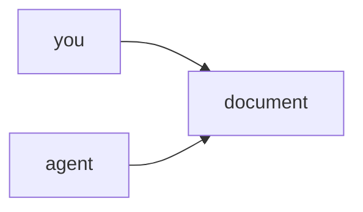

This workspace is yours, and so is this document: edit it, rewrite it, delete
it. It is an ordinary document — nothing here is special-cased anywhere.

## Blocks

A document is a list of blocks, each one edited on its own. There are four
types: paragraphs and headings, which carry inline marks like **bold**,
*italic* and `code`, plus two source blocks that do not.

```ts
// A code block, tagged with its language.
const workspace = "yours";
```



## Tags and links

This document is tagged `start-here`, which is the group the sidebar files it
under. It links to *Bring your docs in* — and a link is a UUID rather than a
title or a path, so renaming either document never breaks it. Open that one
next.
