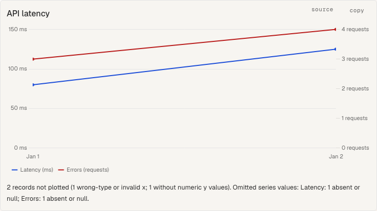
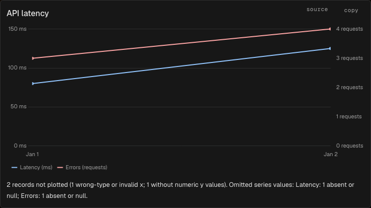
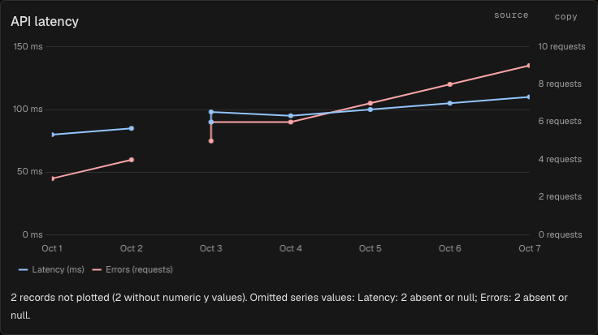
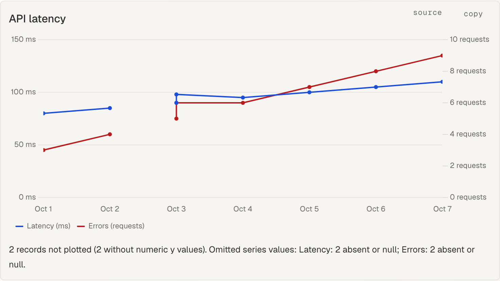
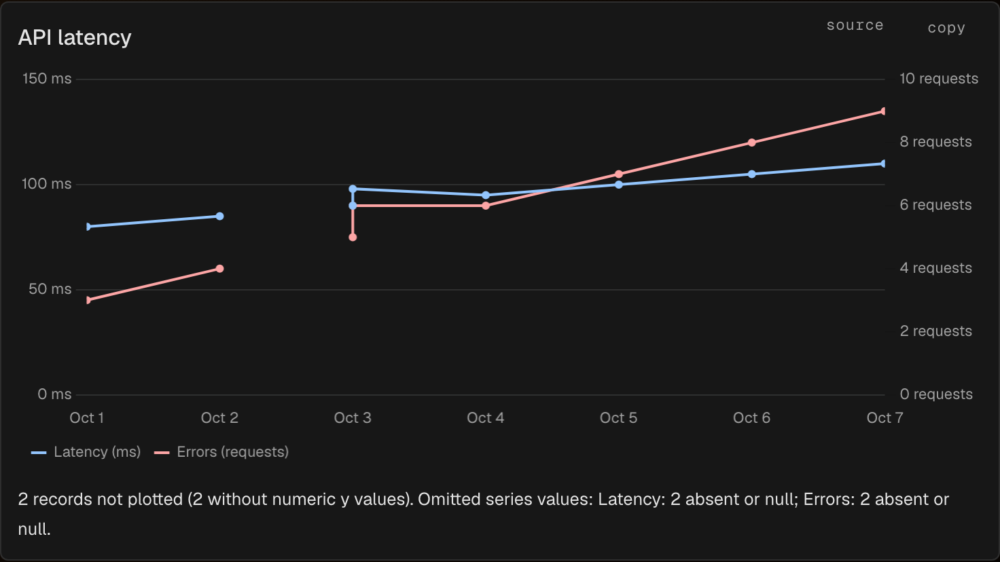
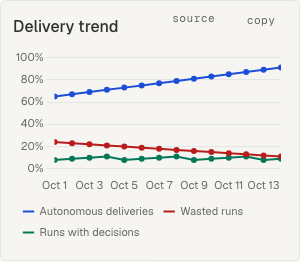
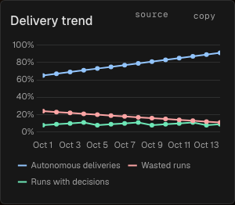

# Chart browser evidence

Synthetic editor fixtures rendered through an isolated production `ub open`
and a separate `ub mcp serve` writer. The chart specification regenerates these
screenshots and measures drawing from the browser's full data availability.
Its observers inspect the existing Yjs document without a product test hook.

| View | Light | Dark |
| --- | --- | --- |
| Two independently scaled units |  |  |
| Seven daily observations, desktop |  |  |
| Seven daily observations, iPad touch |  |  |
| 360 px, three percentage series |  |  |

The browser suite covers source insertion and keyboard/pointer access, live
data and mapping updates, canvas names/descriptions, appearance changes, reopen,
problem recovery and content locks. Canvas observations check that date and
numeric labels anchor only at plotted observations, preserve continuous
spacing, and omit crowded labels only where they overlap retained labels.
The geometry probe resets on each canvas clear and measures painted text
extents, so previous draws cannot satisfy a current-layout assertion.
Daily labels are one month/day line in a single year; tied observations and
empty rows do not introduce time labels. Intraday labels retain UTC and day
context, and full tooltips stay unchanged. The desktop and explicit iPad touch
contexts run in both appearances, with paired Chromium and WebKit coverage.
The suite also checks legend placement, opposite-side unit ticks, the editor's
font, same-x tooltips for sparse series and a visible single-x point.
The compact controls are checked on charts, tables and empty chart panels.
Timing fixtures contain a 2.7 MB area with
4,400 records and a 365-record/three-series chart, plus 5,001 stored records
limited to the latest 5,000/eight series. Chromium uses a 1366×768 viewport,
en-US locale and twofold CPU throttling; the PR records the measured values and
the host class. Unit suites defend value semantics, non-destructive invalid
merges, zero renderer writes, frame coalescing, observer release and old-client
preservation.

The committed [representative timing capture](timing-representative.json) and
[5,000-record timing capture](timing-bound.json) were recorded on macOS Apple
Silicon with the suite's twofold Chromium CPU throttling. They are observations
from this host, not a cross-host performance guarantee.

Regenerate the chart screenshots and timing attachments, with shared-frame
table regression coverage:

```sh
mise run e2e -- chart.spec.ts data-table.spec.ts --project=chromium
```

The tests attach cropped blocks named `chart-light.png`, `chart-dark.png`,
`chart-daily-desktop-light.png`, `chart-daily-desktop-dark.png`,
`chart-daily-ipad-light.png`, `chart-daily-ipad-dark.png`,
`chart-phone-light.png` and `chart-phone-dark.png`. Copy the fresh Chromium
attachments into the committed evidence (the command refuses missing or
ambiguous matches):

```sh
python3 -c 'from pathlib import Path; from shutil import copyfile; source = Path("packages/web/test-results"); target = Path("packages/web/e2e/evidence/chart"); files = {"chart-light.png": "light.png", "chart-dark.png": "dark.png", "chart-daily-desktop-light.png": "daily-desktop-light.png", "chart-daily-desktop-dark.png": "daily-desktop-dark.png", "chart-daily-ipad-light.png": "daily-ipad-light.png", "chart-daily-ipad-dark.png": "daily-ipad-dark.png", "chart-phone-light.png": "phone-light.png", "chart-phone-dark.png": "phone-dark.png"}; matches = {name: [path for path in source.rglob(name) if path.parent.name.endswith("-chromium")] for name in files}; assert all(len(paths) == 1 for paths in matches.values()), matches; [copyfile(matches[name][0], target / destination) for name, destination in files.items()]'
```

The paired desktop/iPad test is tagged for WebKit; it explicitly creates the
iPad context instead of treating a narrow desktop viewport as a touch device.
The phone test is tagged for the supported iPhone WebKit project. Run both:
`mise run e2e -- chart.spec.ts --project=webkit-macbook --project=webkit-iphone`.
Copy the Chromium evidence before this second run, because Playwright clears
its prior output directory.

The shared gate records timings and
asserts complete data availability, successive live redraws and zero renderer
writes; host-dependent wall-clock timings do not fail it. To enforce the
recorded budgets on a benchmark host, run
`env UB_CHART_TIMING_BUDGETS=1 mise run e2e -- chart.spec.ts --project=chromium --workers=1`.
That opt-in requires representative first draw within 500 ms and median redraw
within 250 ms, plus bounded first draw, median and every redraw within 1,000 ms.
