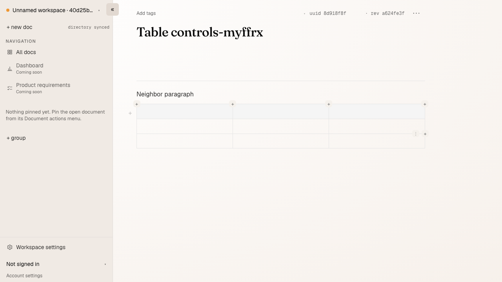
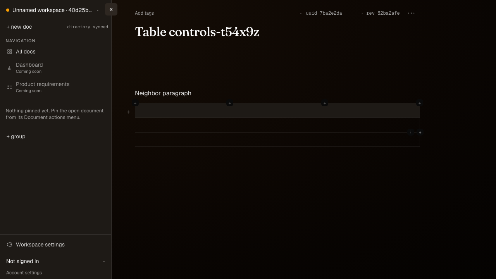

# Compact table controls

Synthetic editable-table screenshots from `table-controls.spec.ts`, at the
Chromium laptop viewport in light and dark appearance. The caret is in the
neighbouring paragraph; only the hovered second row reveals its row controls.
The owner's example document was read through MCP and was not edited.





Reproduce with:

```sh
mise run e2e -- table-controls.spec.ts table-row-drag.spec.ts table-controls-shared.spec.ts table.spec.ts
```

The tests also exercise native keyboard traversal with the pointer away,
straight pointer travel to row controls and menus, 390px touch targets, partially
scrolled header controls, cell navigation, undo and shared write/shape guards.
The run's PR verification names its candidate and records command results and
the comparison of existing failures with the unchanged main baseline.
